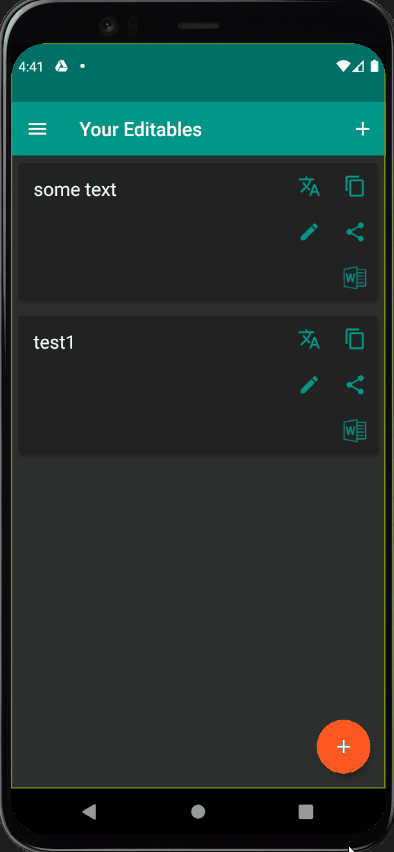

# Final Project

### Objective

Develop an algorithm that takes in an image file, and returns the text found in the image as a string. With the algorithm, build an easy-to-use app that'll allow users to scan or upload an image of a document or handwritten text, and "extract" the text from them.

## The Server

The server running the algorithm is comprised of many modules, each tasked with a different part of the objective.

#### File Tree

```
Server
├── Procfile
├── Procfile.windows
├── base_model.py
├── consts.py
├── cv.py
├── hough_rect.py
├── noise_remover.h5
├── noise_remover.py
├── ocr.py
├── ocr_model.h5
├── ocr_model.py
├── preprocessing.py
├── requirements.txt
├── runtime.txt
├── server.py
└── train_models.py
```

#### Methods

The Python server communicates through HTTP using the [FastAPI](https://fastapi.tiangolo.com/) library in Python.

* `/find_page_points` - To find the region-of-interest of the image (usually the page). Takes in a JSON object, that has one key-value pair - the key is "b64image", and the value is the image encoded as base64 string. Returns a JSON with a list of four objects ("points"), each with x and y position on the image.
* `/image_to_text` - To detect the text in an image. Takes in a JSON object, that holds the image (key is "b64image") as a base64 string. Also optional is a list of points of the region-of-interest (key is "points") encoded as JSON object with integer x and y components. If "points" isn't provided, the server will try to find them automatically (if that fails, process the entire image).
* `/text_to_docx/{text}` - To put the text in a Microsoft word (DOCX) document (used by the app).

#### How Does It Work?

When a base64 image is received by the server, first the image is decoded and transformed into a 2D grayscale image represented by a NumPy array (see `decode_image` in `server.py` for possible errors and their appropriate responses).

Afterwards, the corners of the page (ROI) are calculated. Lines are detected in the image using the Probabilistic Hough Line Transform algorithm, and then the points-of-intersection between the lines are calculated.

Using the points, the original image is transformed to only include the area enclosed by these points, and some other preprocessing filters and transformations are applied. If no points are found, the whole image is preprocessed.

In the preprocessed image, the bounding rectangles of the contours of each individual characters are found. The rectangles are sorted to the correct order of characters present in the image, and spaces are detected between each sequence of characters (word).

Each individual character is then cut and placed into it's own NumPy array, which is passed through the models. First the image of the character is passed to a denoising autoencoder, which denoises and softens the image. Then, they are passed to the classifier model. Said model is built using TensorFlow's Keras API, and can be loaded from the HDF5 file. The machine-learning model is a CNN (Convolutional Neural Network) comprised of many layers, and was trained with over 300,000 images from the [EMNIST database](https://www.nist.gov/srd/nist-special-database-19) (Extended Modified National Institute of Standards and Technology database - using the merged version). The model is able to classify an image of a character to a 92.25% accuracy. The model outputs only lowercase letters and digits, but the input may also be an uppercase character. If you wish to train the model by yourself, download the image files, change the train and validation paths in `consts.py` and run `train_models.py` (be advised - the process may take over 24 hours and it will operate better on a GPU).

After joining the characters outputted from the classifier, spellchecking is performed on the text, to fix any other errors which occurred during the classification process. The output text is then returned to the client.

###### Note

The classification process will run much faster on a GPU, and using a GPU is recommended since TensorFlow takes advantage of GPU acceleration.

#### Running The Server

Attached are also the files necessary to deploy the server to [heroku](https://heroku.com).

To run the server locally (**make sure you have [Python 3.8](https://python.org/downloads/release/python-386/) installed** - TensorFlow 2.4 doesn't support other versions of Python right now):

```bash
git clone https://github.com/TomerGibor/Final-Project.git
cd ./Server
pip install -r requirements.txt
python server.py
```

---

## The App - "Editable"

The app is written in the [Flutter](https://flutter.dev) framework using the [Dart](https://dart.dev) programming language. The app is named Editable, since you can take a picture of some text and extract the text from the image and edit it digitally.

#### File Tree

```
App/Editable
└── lib
    ├── helpers
    │   ├── db_helper.dart
    │   ├── file_helper.dart
    │   └── http_helper.dart
    ├── main.dart
    ├── providers
    │   ├── editables.dart
    │   └── settings.dart
    ├── screens
    │   ├── add_editable_screen.dart
    │   ├── edit_editable_screen.dart
    │   ├── home_screen.dart
    │   ├── select_points_on_image_screen.dart
    │   └── settings_screen.dart
    └── widgets
        ├── app_drawer.dart
        ├── editable_item.dart
        ├── error_dialog.dart
        └── image_input.dart
```

#### How To Use

Use the `+` button to add an Editable. Select an image from device storage or take a picture with the camera and press the `Submit` button. Then, if it is enabled in settings, you will be able to check if the page corners are set properly, and if not you will be able to correct then yourself. Press `Confirm` and after a few seconds (or minutes - depends on how much text there is and the speed of your CPU or GPU) the Editable will be added to the list!



You can also customize the looks of the app in the settings!


On the Editable you can perform many operations: edit, copy, share, download as word and translate.


#### Note

To use the app with the server, change the URL of the server in the `http_helper.dart` module to your server URL.